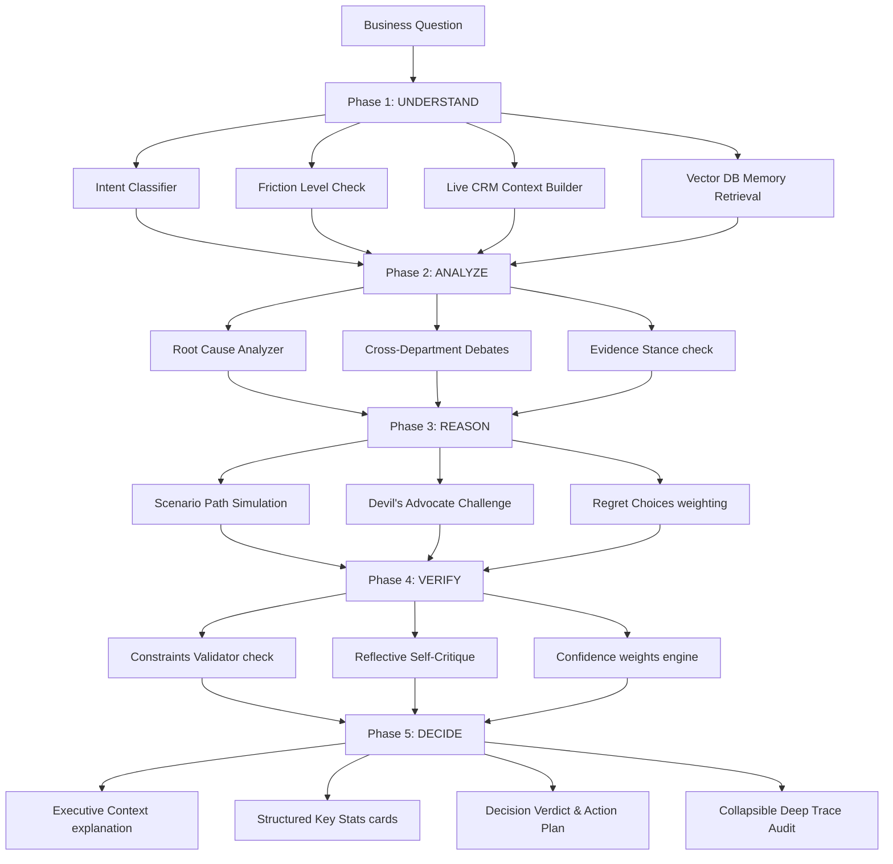

# Friction — Resilient Multi-Agent Cognitive Business Reasoning Engine

Friction is an enterprise-grade, board-level cognitive reasoning advisor designed to help business owners resolve complex operational tensions. Instead of responding with generic answers, it analyzes live CRM data, simulates scenarios, debates stances across departments, and resolves decisions against strict operational constraints.

The engine uses a resilient pipeline leveraging **NVIDIA's Nemotron-3-Ultra-550B** as the primary synthesis engine (for deep cognitive thinking) and automatically falls back to **Groq's Llama 3.3 70B** versatile model if NVIDIA rate limits or worker capacity limits (503 Service Unavailable) are encountered.

---

## 🏗️ Cognitive Pipeline Architecture

The reasoning process follows a rigorous 5-Phase, 16-Module reasoning structure:



---

## ✨ Key Features

1. **Resilient Synthesis Engine**: Streams reasoning content from Nvidia Nemotron-3-Ultra with a strict 60s socket-level timeout. Automatically redirects requests to Groq's Llama 3.3 70B Versatile model on worker exhaust limits.
2. **13 Integrated CRM Databases**: SQLite database containing seeded, synthetic CRM tables:
   - **Customers** (Average LTV, churn risks)
   - **Deals Pipeline** (Open deals value, statuses)
   - **Financials** (18 months MRR, profit margins)
   - **Team** (Roles, payroll, hiring pipelines)
   - **Past Decisions** (Previous business successes/failures)
   - **Products & SKUs** (Margins, sales volumes)
   - **Inventory** (Reorder thresholds, stock levels)
   - **Marketing Campaigns** (Spent budgets, ROI yields)
   - **Support Tickets** (Open tickets, average CSAT score)
   - **Suppliers & Vendors** (Reliability rankings)
   - **Expenses** (Monthly operational burn)
   - **Quarterly KPIs** (ARR metrics, NPS scores)
   - **Contracts** (Active Arr value, renewals)
3. **Advanced Data Sources Modal**: Full-screen sidebar viewer in the UI allowing the user to view, filter, and audit live rows from all 13 CRM databases.
4. **De-congested Spacious Dashboard**:
   - Executive Context Narrative explains the business metrics first.
   - Structured Key Stats card strip second.
   - Statistical Logic third.
   - Definitive Decision Verdict fourth.
   - Spaced actionable numbered items with titles and timeframes.
   - Collapsible Advanced Pipeline Audit accordion at the bottom to check the reasoning of all 16 modules without cluttering the screen.

---

## 🛠️ Installation & Setup

### Prerequisites
- Python 3.10+
- Node.js 18+
- Git

### 1. Setup Backend
Open a terminal in the `backend/` directory:

```bash
cd backend
# Create virtual environment
python -m venv .venv
# Activate virtual environment (Windows)
.venv\Scripts\activate
# Activate virtual environment (macOS/Linux)
source .venv/bin/activate

# Install dependencies
pip install -r requirements.txt
```

Create a `.env` file in the `backend/` root directory and add your API keys:
```env
NVIDIA_API_KEY=nvapi-your-nvidia-key-here
GROQ_API_KEY=gsk_your-groq-key-here
```

Seed the databases (generates SQLite `crm.db` and Vector DB `crm_knowledge.json`):
```bash
python data/seed_db.py
```

Start the backend API server:
```bash
python main.py
```
*The server will initialize sentence transformers, build Chroma vectors, and start running on [http://localhost:8000](http://localhost:8000).*

### 2. Setup Frontend
Open a terminal in the `frontend/` directory:

```bash
cd frontend
# Install packages
npm install
# Start dev server
npm run dev
```
*The dev server will host the gorgeous UI dashboard on [http://localhost:5173](http://localhost:5173).*

---

## 🚀 Usage

1. Open the UI dashboard on [http://localhost:5173](http://localhost:5173).
2. Input a strategic question (e.g. *"Should we expand our sales team or hire more developers?"* or *"Who is our highest risk customer?"*).
3. Click **Reason Decision** and watch the multi-agent trace stream live.
4. Review the structured context, stats explanation, verdict banner, and action plan.
5. Click **Data Sources** on the sidebar to audit the underlying database rows.
